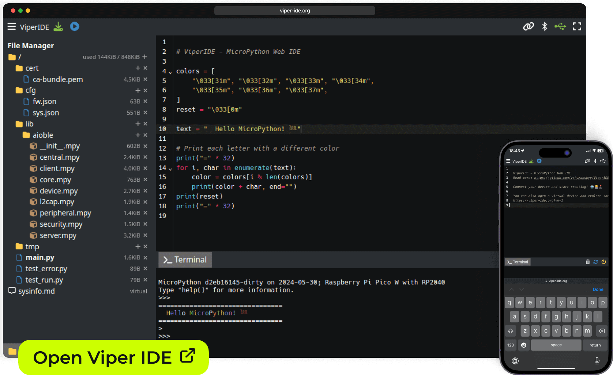

# HTLR-MPyRIDE

<!-- -->
 
 
 
 
  

**HTLR-MPyRIDE** (*HTL Rankweil - MicroPython Remote IDE*) ist eine angepasste und erweiterte Version der [**ViperIDE**](https://github.com/vshymanskyy/ViperIDE), optimiert für den Einsatz an der [**HTL Rankweil**](https://www.htl-rankweil.at/) speziell für den [**Arduino Alvik**](https://www.arduino.cc/education/arduino-alvik/) im Rahmen des MicroPython-Unterrichts.

Das Ziel dieser Fork-Version ist es, eine browserbasierte **Remote-IDE für MicroPython** bereitzustellen, die nahtlos mit Microcontrollern wie dem **ESP32** zusammenarbeitet – sowohl lokal als auch über das Netzwerk. Zusätzlich wurden Features für den schulischen Einsatz ergänzt und angepasst.

|                                |   |
|--------------------------------|---|
|  |  |

## 🔧 Features

- **Keine Installation notwendig**
  - Läuft vollständig im Browser (auch auf Smartphones oder Tablets)
  - Unterstützt Offline-Nutzung
- **Flexible Verbindungsmöglichkeiten**
  - Serielle Verbindung via USB
  - Remote-Verbindung über Netzwerk/WebSocket (z. B. zu einem ESP32)
- **MicroPython-Entwicklung**
  - Syntax-Highlighting & Echtzeit-Codeanalyse
  - REPL/Terminal-Integration
  - Grundlegende Autovervollständigung
  - Integration einer MicroPython-VM zu Testzwecken
- **Projekt- & Dateimanagement**
  - Integrierter Datei-Explorer
  - Hochladen, Bearbeiten und Löschen von Dateien
  - Unterstützung für `.mpy`-Kompilierung und Minifizierung

## 📎 Ursprung & Danksagung

Diese IDE basiert auf dem hervorragenden Projekt [**ViperIDE von vshymanskyy**](https://github.com/vshymanskyy/ViperIDE), welches unter der MIT-Lizenz veröffentlicht wurde.  
Ein besonderer Dank gilt dem ursprünglichen Autor für die solide Grundlage und die offene Lizenzierung.

## 📚 Links

- [Originalprojekt – ViperIDE](https://github.com/vshymanskyy/ViperIDE)  
- [Feature-Übersicht](./docs/Features.md)  
- [Feedback & Ideen](./docs/Feedback.md)  
- [Dokumentation](./docs/)  
- [MicroPython Discussions](https://github.com/orgs/micropython/discussions/15219)
- [Arduino Alvik](https://www.arduino.cc/education/arduino-alvik/)
- [HTL Rankweil](https://www.htl-rankweil.at/)

## 🧰 Eingesetzte Software

- [CodeMirror](https://codemirror.net) – Code-Editor (MIT)
- [Ruff](https://docs.astral.sh/ruff) – Linter & Formatter (MIT)
- [Xterm.js](https://xtermjs.org) – Terminal/REPL (MIT)
- [PeerJS](https://peerjs.com) – P2P/WebRTC-Kommunikation (MIT)
- [MicroPython](https://github.com/micropython/micropython) – VM (MIT)
- [mpy-cross](https://github.com/micropython/micropython/tree/master/mpy-cross) – Bytecode-Compiler (MIT)
- [mpy-tool](https://github.com/micropython/micropython/blob/master/tools/mpy-tool.py) – Bytecode-Disassembler (MIT)
- [python-minifier](https://github.com/dflook/python-minifier) – Code-Minifier (MIT)